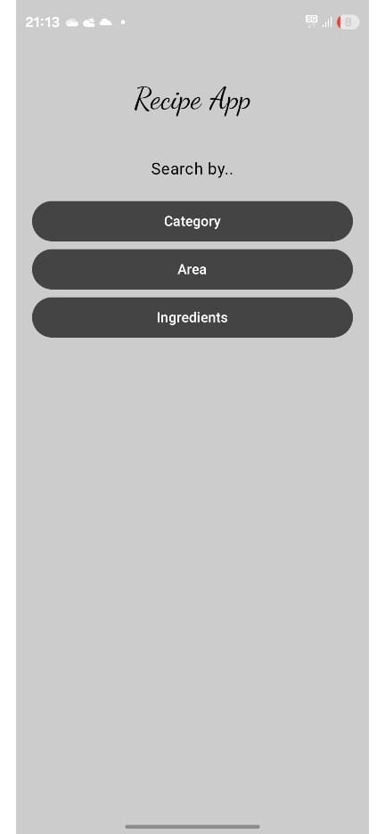
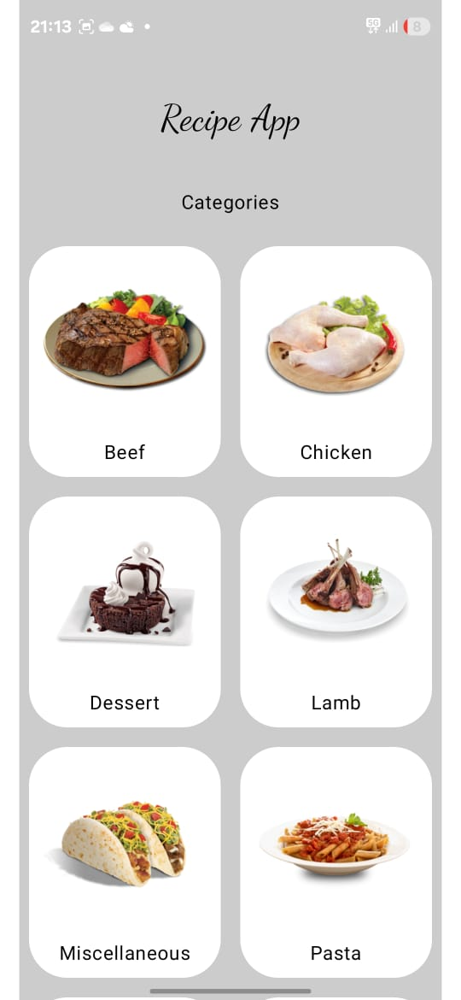
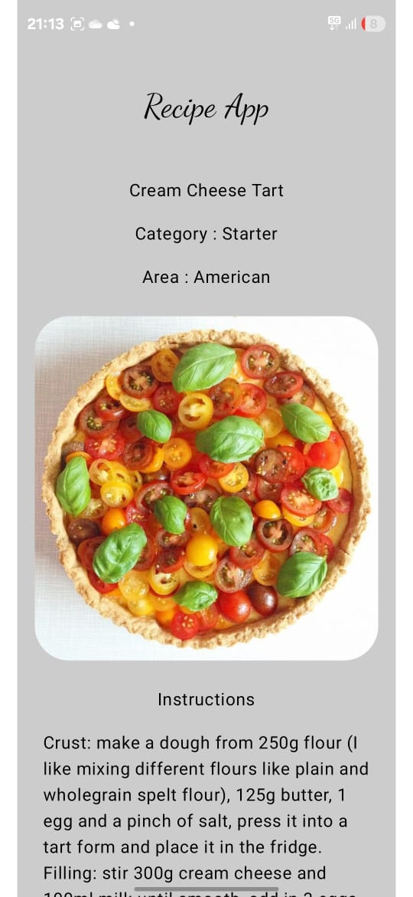
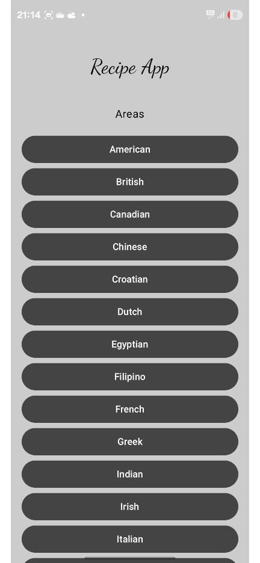

# 🍽️ Recipe App

A modern Android application to explore delicious recipes from around the world.  
Built with **Jetpack Compose**, **MVVM Architecture**, and **Retrofit**, powered by [TheMealDB API](https://www.themealdb.com/).  

## ✨ Features
- 🔍 **Browse Recipes** by:
  - Category (Desserts, Seafood, etc.)
  - Area (Cuisine by country/region)
  - Ingredient
- 📄 **Detailed Recipe Pages** with:
  - Step-by-step instructions
  - High-quality images
  - YouTube video tutorials
- 📱 **Modern Android Tech Stack**
  - MVVM architecture
  - Jetpack Compose for UI
  - Retrofit for API integration

---

## 🖼 Screenshots

| Home Screen | Categories | Recipe Details | Areas |
.....

|  |  |  |  |

---

## 🛠 Tech Stack
- **Language:** Kotlin
- **UI:** Jetpack Compose
- **Architecture:** MVVM
- **Networking:** Retrofit
- **API:** [TheMealDB](https://www.themealdb.com/)

---

## 🚀 Getting Started
1. Clone the repository:
   ```bash
   git clone https://github.com/yourusername/recipe-app.git
   cd recipe-app
   ```
2. Open in **Android Studio**.
3. Add your API key in `local.properties`:
   ```properties
   THE_MEAL_DB_API_KEY=your_api_key_here
   ```
4. Build & Run.

---

## 📜 License
This project is licensed under the MIT License.
